Controladores PID difusos para un proceso de evaporación de circulación
forzada

Juan Pablo Requez Vivas

1398086

juanrequez@gmail.com

**Resumen:** Se presenta un análisis experimental del diseño de
controladores difusos basados en los controladores clásicos
Proporcional-Integral-Derivativo (PID). En particular se describe el
procedimiento para la conversión directa de controladores convencionales
a tres formas difusas de ellos usando el modelo de inferencia Mamdani,
el de Takagi-Sugeno y el de Tsukamoto. Estos controladores son
implementados sobre el modelo lineal normalizado de un proceso de
evaporación de circulación forzada. Se muestra las diferencias entre la
implementación en cada sistema de inferencia y los efectos que estas
diferencias tienen sobre el mismo y se compara con otros controladores
difusos diseñados previamente para el sistema no lineal asociado.

**Palabras clave:** Control Difuso; Controladores PID difusos;
Evaporador de circulación forzada, Modelo difuso Mamdani; Modelo difuso
Takagi-Sugeno; Modelo Difuso Tsukamoto.

# INTRODUCCIÓN

La mayor cantidad de los controladores utilizados en los procesos
industriales son controladores PID \[1\]. Cuando se desea regular a un
proceso alrededor de la referencia, se usa como entrada para el PID el
error y su variación, y es de esperarse que estas variables también se
usen para un controlador difuso. El problema principal de la utilización
de un controlador difuso, es que, por ser un controlador no lineal,
presenta dificultades para su diseño, comprobación y verificación de
funcionamiento en el momento de diseño.

Se presenta un algoritmo \[1\] que permite entonar los parámetros de un
controlador difuso basado en los parámetros de entonamiento de un
controlador PID convencional. Para ello se puede realizar el
entonamiento de un controlador PID y luego reemplazarlo por un
controlador difuso realizando algunos cálculos sobre los parámetros de
entonamiento. El procedimiento descrito permite, conocido un modelo de
un proceso, obtener un controlador difuso no lineal basado en el
procedimiento de entonamiento de un controlador PID.

## Generalidades de la lógica difusa

El concepto de conjunto difuso es una generalización del concepto
clásico de conjunto. La diferencia fundamental estriba en que, mientras
que en la teoría clásica de conjuntos un determinado elemento puede
pertenecer a un conjunto o no hacerlo, en la teoría de conjuntos difusos
un elemento puede pertenecer a más de un conjunto con diferentes grados
de pertenencia.

El grado de pertenencia de x al conjunto A, $\mu_{A}(x)$, es un número
real dentro del intervalo \[0, 1\] que indica en qué proporción
pertenece un determinado elemento a un conjunto. De este modo, si un
elemento tiene un grado de pertenencia cero respecto a un conjunto dado,
será equivalente a decir que dicho elemento no pertenece a dicho
conjunto. Análogamente, si un elemento tiene un grado de pertenencia
uno, se dirá que dicho elemento se encuentra totalmente dentro del
conjunto.

La función de pertenencia describe el grado de pertenencia de los
diferentes elementos del universo de discurso al conjunto difuso. La
elección de la forma de la función de pertenencia es subjetiva y
dependiente del contexto. La Fig. 1 muestra algunas de las funciones de
pertenencia más comunes

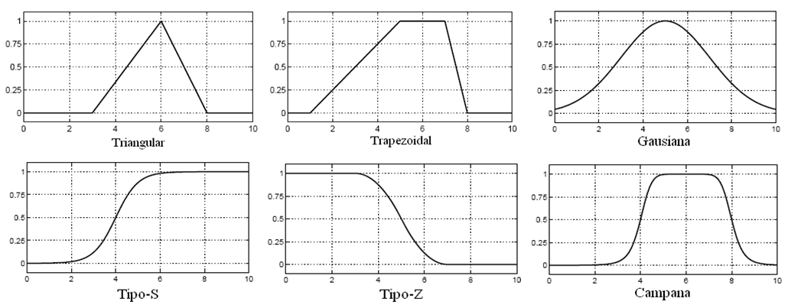{width="3.1666666666666665in"
height="1.3919411636045493in"}

Fig. 1 Funciones de pertenencia usuales \[2\]

## Modelo de inferencia de Mamdani

El modelo de inferencia mamdani posee cuatro pasos básicos:

1)  *Difusificación (Fuzzification)*

Se toman las entradas del sistema y se determina el grado de pertenencia
de cada valor a los conjuntos difusos respectivos.

2)  *Evaluación de reglas*

Las entradas difusificadas son aplicadas a los antecedentes de las
reglas difusas. Si una regla difusa tiene múltiples antecedentes, el
operador AND u OR se usa para obtener un número único que representa a
la evaluación de los antecedentes. Para la evaluación numérica de una
disyunción por lo general se utiliza el operador de unión, como se
muestra en la Eq. (1).

  ------------------------------------------------------------------------
  $$\mu_{(A \cup B)}(x) = max\{\mu_{A}(x),\mu_{B}(x)\}$$           \(1\)
  ---------------------------------------------------------------- -------

  ------------------------------------------------------------------------

Para la evaluación de la conjunción se usa el operador de intersección,
como se muestra en Eq. (2)

  -----------------------------------------------------------------------
  $$\mu_{A \cap B}(x) = min\{\mu_{A}(x),\mu_{B}(x)\}$$           \(2\)
  -------------------------------------------------------------- --------

  -----------------------------------------------------------------------

Luego el resultado de la evaluación del antecedente de la regla se
aplica a función de pertenencia del consecuente de la regla. El método
más común \[3\] es el truncamiento de la función de pertenencia al nivel
del el grado de verdad del antecedente.

3)  *Agrupación de las salidas de las reglas*

Las funciones de pertenencia de todos los consecuentes de las reglas
previamente truncadas son combinadas en un conjunto difuso único.

4)  *Desdifusificación (defuzzification)*

Se determina el valor de salida a través de la determinación del centro
de área resultante del conjunto de agrupación de las salidas. Por lo
general, se utiliza un estimado del centro de área a través de la
discretización del conjunto de salida.

Una representación del funcionamiento del modelo de inferencia de
Mamdani se muestra en la Fig. 2.

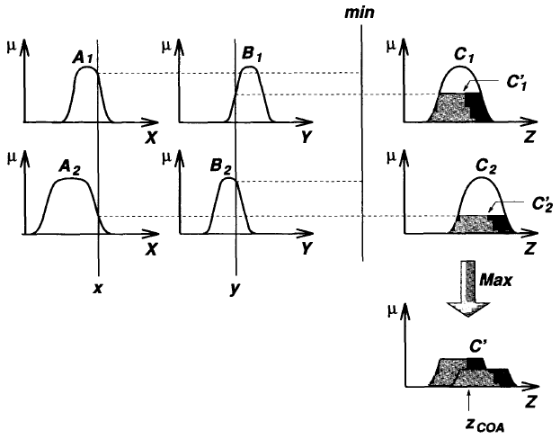{width="3.1666666666666665in"
height="2.4805555555555556in"}

Fig. 2. Ilustración del modelo de inferencia de Mamdani \[4\]

## Modelo de Inferencia de Takagi-Sugeno

El modelo de inferencia de Takagi-Sugeno modifica la evaluación de las
reglas al asignar una función matemática al consecuente de cada regla.
Es más eficiente computacionalmente y es más conveniente para el
análisis matemático y en análisis de sistemas, garantizando continuidad
de la superficie de respuesta \[5\].

1)  *Difusificación (Fuzzification)*

Se toman las entradas del sistema y se determina el grado de pertenencia
de cada valor a los conjuntos difusos respectivos.

2)  *Evaluación de reglas*

Las entradas difusificadas son aplicadas a los antecedentes de las
reglas difusas.

Para la evaluación de la conjunción se usa el operador de intersección
como el producto de las pertenencias de los antecedentes, como se
muestra en (3)

  ------------------------------------------------------------------------
  $$\mu_{A \cap B}(x) = \mu_{A}(x)\ \mu_{B}(x)$$                   \(3\)
  ---------------------------------------------------------------- -------

  ------------------------------------------------------------------------

Luego el resultado de la evaluación del antecedente de la regla se
calcula la función matemática que determina la salida de esa regla en
particular, y depende de los valores de las entradas.

3)  *Valor final*

El valor final del sistema de inferencia se calcula con la media
ponderada de cada uno de los resultados de cada regla.

Una representación del funcionamiento del modelo de inferencia de
Takagi-Sugeno se muestra en la Fig. 3

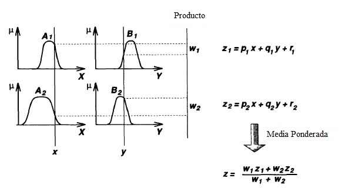{width="3.1666666666666665in"
height="1.7409722222222221in"}

Fig. 3. Ilustración del funcionamiento del modelo de inferencia de
Takagi-Sugeno \[4\]

## Modelo de inferencia de Tsukamoto

En el modelo de inferencia de Tsukamoto, el consecuente de cada regla es
representado por una función de pertenencia monotónica, por lo tanto, la
salida inferida es determinada como el valor de la variable de salida
que produce el nivel de activación de la regla determinado en la
evaluación del antecedente \[4\]. Igual que en el modelo de
Takagi-Sugeno, la salida completa es la media ponderada de las entradas.
Una representación del funcionamiento del modelo de Inferencia de
Tsukamoto se muestra en la Fig. 4.

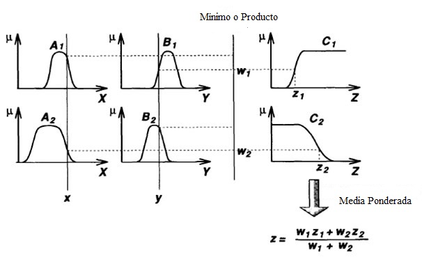{width="3.1666666666666665in"
height="1.9284722222222221in"}

Fig. 4. Ilustración del funcionamiento del modelo de inferencia de
Tsukamoto \[4\]

## Algoritmo de conversión aproximada de controladores PID en controladores difusos

### *Entonamiento de un controlador PID*.

Un controlador PID general está descrito por

  ------------------------------------------------------------------------------------------------
  $$u = K_{p}\left( e + \frac{1}{T_{i}}\int_{o}^{t}{e*dt} + T_{d}\frac{de}{dt} \right)$$   \(4\)
  ---------------------------------------------------------------------------------------- -------

  ------------------------------------------------------------------------------------------------

Donde

Kp es la ganancia proporcional

Ti es el tiempo integral

Td es el tiempo derivativo

Esta ecuación puede ser discretizada a través de la utilización del
período de muestreo del proceso, Ts, la cual conduce, de forma
aproximada, a representarla de esta manera

  --------------------------------------------------------------------------------------------------------------------------------------
  $$u_{n} = K_{p}\left( e_{n} + \frac{1}{T_{i}}\sum_{j = 1}^{n}{e_{j}T_{s} + T_{d}\frac{e_{n} - e_{n - 1}}{T_{s\ }}} \right)$$   \(5\)
  ------------------------------------------------------------------------------------------------------------------------------ -------

  --------------------------------------------------------------------------------------------------------------------------------------

Esta nueva representación será útil para observar las entradas del
controlador difuso.

Se conocen muchos procedimientos para el entonamiento de un controlador
PID basado en un modelo de identificación del proceso. Los valores
adecuados de Kp, Ti y Td se pueden conseguir con distintos
procedimientos.

###  Obtención del controlador difuso.

El controlador difuso debe analizarse de acuerdo al tipo de controlador
que se requiera para el sistema. Existe una configuración diferente para
cada controlador, ya sea Proporcional (P), Proporcional-Derivativo (PD),
proporcional-Integral (PI) y proporcional-Integral-Derivativo (PID). A
fin de garantizar la conversión se pueden tener en cuenta las siguientes
condiciones:

#### Universo de entrada: 

-   Los conjuntos de entrada deben ser suficientemente grandes para
    estar contenidas dentro de los límites (no hay saturación)

-   Los conjuntos deben ser triangulares y cortar a sus vecinos en el
    valor de membresía μ=0.5

#### Número de reglas:

-   Debe aplicarse la combinación AND (y) de todos los términos. Los
    conjuntos de salida deben triangulares con el pico en la posición de
    la suma los picos de los conjuntos de entrada.

-   Las reglas se describen como el producto cartesiano de los conjuntos
    de entrada.

#### Conectivo lógico:

-   Para garantizar la linealidad, se debe escoger el producto
    algebraico para el conectivo Y (AND). El método de desdifusificación
    debe ser el Centro de Gravedad.

## Procedimiento para convertir las ganancias de un controlador PID a uno difuso:

1)  *Controlador Proporcional Difuso (FP):*

```{=html}
<!-- -->
```
1)  La entrada es el error e

2)  Determine el rango del error e,

  ------------------------------------------------------------------------
  $$e \in \left\lbrack - e_{r},e_{r} \right\rbrack$$               \(6\)
  ---------------------------------------------------------------- -------

  ------------------------------------------------------------------------

3)  Determine el valor de GE de manera que E tenga un rango \[-1, 1\],

  ------------------------------------------------------------------------
  GE=1/e~r~                                                        \(7\)
  ---------------------------------------------------------------- -------

  ------------------------------------------------------------------------

4)  Calcule GU de manera que GE\*GU=Kp

  ------------------------------------------------------------------------
  GU=Kp/GE=e~r~Kp                                                  \(8\)
  ---------------------------------------------------------------- -------

  ------------------------------------------------------------------------

{width="3.1496062992125986in"
height="1.2524114173228347in"}

Fig. 5 controlador FP

2)  *Controlador Proporcional Integral (FPI)*

Se representa como un controlador proporcional integral con acción de
incremento

1)  Las entradas son el error e y el cambio del error ce

2)  Determine el rango del error e,

  ------------------------------------------------------------------------
  $$e \in \left\lbrack - e_{r},e_{r} \right\rbrack$$               \(9\)
  ---------------------------------------------------------------- -------

  ------------------------------------------------------------------------

3)  Determine el valor de GE de manera que E tenga un rango \[-1, 1\],

  -------------------------------------------------------------------------
  GE=1/e~r~                                                        \(10\)
  ---------------------------------------------------------------- --------

  -------------------------------------------------------------------------

4)  Determine el valor de GCE de manera que GE/GCE=1/Ti

  -------------------------------------------------------------------------
  GCE=TiGE                                                         \(11\)
  ---------------------------------------------------------------- --------

  -------------------------------------------------------------------------

5)  Determine GCU de manera que GCE\*GCU=Kp

  -------------------------------------------------------------------------
  GCU=Kp/GCE                                                       \(12\)
  ---------------------------------------------------------------- --------

  -------------------------------------------------------------------------

{width="3.1496062992125986in"
height="0.9657097550306212in"}

Fig. 6. Controlador FPI

3)  *Controlador Proporcional Integral derivativo difuso (FPD+I)*

```{=html}
<!-- -->
```
1)  Las entradas son el error e, el cambio del error ce y la integral
    del error ie

2)  Determine el rango del error e,

  -------------------------------------------------------------------------
  $$e \in \left\lbrack - e_{r},e_{r} \right\rbrack$$               \(13\)
  ---------------------------------------------------------------- --------

  -------------------------------------------------------------------------

3)  Determine el valor de GE de manera que E tenga un rango \[-1, 1\],

  -------------------------------------------------------------------------
  GE=1/e~r~                                                        \(14\)
  ---------------------------------------------------------------- --------

  -------------------------------------------------------------------------

4)  Calcule GU de manera que GE\*GU=Kp

  -------------------------------------------------------------------------
  GU=Kp/GE                                                         \(15\)
  ---------------------------------------------------------------- --------

  -------------------------------------------------------------------------

5)  Calcule GCE de manera que GCE/GE=Td

  -------------------------------------------------------------------------
  GCE=Td\*GE=Td/e~r~                                               \(16\)
  ---------------------------------------------------------------- --------

  -------------------------------------------------------------------------

6)  Calcule GIE de manera que GIE/GE=1/Ti

  -------------------------------------------------------------------------
  GIE=GE/Ti                                                        \(17\)
  ---------------------------------------------------------------- --------

  -------------------------------------------------------------------------

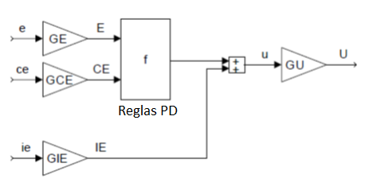{width="3.1496062992125986in"
height="1.6269794400699913in"}

Fig. 7. Controlador FPD+I

Tabla 1. Parámetros de entonamiento de los controladores PID difusos a
partir de los parámetros de entonamiento del PID clásico

  -----------------------------------------------------------------------
                GE           GIE              GCE         GU
  ------------- ------------ ---------------- ----------- ---------------
  FP            1/e~r~                                    e~r~Kp

  FPI           1/e~r~                        Ti/ e~r~    e~r~ Kp/Ti

  FPD+I         100/e~r~     1/(e~r~\*Ti)     Td/e~r~     e~r~\*Kp
  -----------------------------------------------------------------------

# PROCEDIMIENTO EXPERIMENTAL

A.  *Modelo del evaporador*

En el modelo del evaporador de circulación forzada presentado en \[6\]
\[7\], la alimentación se mezcla con un gran flujo volumétrico de
recirculación de disolución concentrada, y se bombea hacia el
intercambiador de calor vertical. En el intercambiador de calor se
emplea vapor de agua que condensa en la pared exterior de los tubos. El
líquido que pasa por el interior de los tubos, en ebullición, pasa al
separador, donde el líquido y el vapor se separan. Parte del líquido
concentrado es retirado como producto, mientras la mayor parte es
recirculado al sistema. El vapor es condensado por enfriamiento,
utilizando agua como refrigerante.

El modelo matemático del evaporador de circulación forzada de tubos
verticales descrito por \[6\], fue obtenido a partir de balances de
materia y energía. El modelo está conformado por tres ecuaciones
diferenciales y nueve ecuaciones algebráicas. En la Tabla 1 se presentan
las variables dinámicas relacionadas con la descripción del proceso, sus
valores en estado estacionario y las unidades de ingeniería en que son
expresadas, y se muestran esquemáticamente en la figura 1,. En la Tabla
2 se listan parámetros que son asumidos como constantes en el modelo.

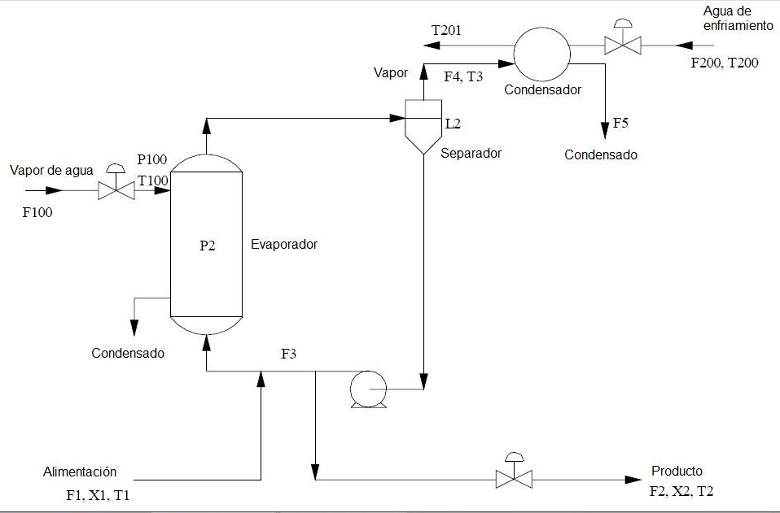{width="3.1496062992125986in"
height="2.025382764654418in"}

Fig. 8. Diagrama del proceso

Tabla 2. Variables del evaporador \[6\].

  -----------------------------------------------------------------------
             Descripción                          Valor      Unidad
  ---------- ------------------------------------ ---------- ------------
  F1         Flujo másico de alimento diluido     10,0       kg/min

  F2         Flujo másico de alimento concentrado 2,0        kg/min

  F3         Flujo másico de recirculación        50,0       kg/min

  F4         Flujo de vapor                       8,0        kg/min

  F5         Flujo de condensado                  8,0        kg/min

  X1         Concentración de soluto en el        5,0        \%
             alimento diluido                                

  X2         Concentración de soluto en el        25,0       \%
             alimento concentrado                            

  T1         Temperatura del alimento diluido     40,0       °C

  T2         Temperatura del alimento concentrado 84,6       °C

  T3         Temperatura del vapor                80,6       °C

  L2         Nivel en el separador                1,0        m

  P2         Presión de operación del evaporador  50,5       kPa

  F100       Flujo de vapor de agua               9,3        kg/min

  T100       Temperatura de vapor de agua         119,9      °C

  P100       Presión de vapor de agua             194,7      kPa

  Q100       Potencia del rehervidor              339,0      kW

  F200       Flujo de agua de enfriamiento        208,0      kg/min

  T200       Temperatura de entrada del agua de   25,0       °C
             enfriamiento                                    

  T201       Temperatura de salida del agua de    46,1       °C
             enfriamiento                                    

  Q200       Potencia del condensador             307,9      kW
  -----------------------------------------------------------------------

Tabla 3. Parámetros constantes del modelo \[6\].

  --------------------------------------------------------------------------------------------
               **Descripción**                                     **Valor**   **Unidad**
  ------------ --------------------------------------------------- ----------- ---------------
  $$\rho A$$   Producto de la densidad del líquido y el área de la 20,0        kg/m
               sección transversal del separador                               

  M            Cantidad de líquido en el evaporador                20,0        kg

  C            Constante que convierte la masa de vapor en su      4,0         kg/kPa
               equivalente de presión                                          

  C~p~         Capacidad calorífica del líquido y del agua de      0,07        kW/(K.kg.min)
               enfriamiento                                                    

  λ            Calor latente de vaporización del líquido y del     38,5        kW/(kg.min)
               agua de enfriamiento                                            

  λ~s~         Calor latente del vapor de agua a las condiciones   36,6        kW/(kg.min)
               de saturación.                                                  
  --------------------------------------------------------------------------------------------

  -------------------------------------------------------------------------
  $$\rho A\frac{dL2}{dt} = F1 - F4 - F2$$                          \(18\)
  ---------------------------------------------------------------- --------

  -------------------------------------------------------------------------

  -------------------------------------------------------------------------
  $$\frac{MdX2}{dt} = F1X1 - F2X2\ $$                              \(19\)
  ---------------------------------------------------------------- --------

  -------------------------------------------------------------------------

  -------------------------------------------------------------------------
  $$C\frac{dP2}{dt} = F4 - F5$$                                    \(20\)
  ---------------------------------------------------------------- --------

  -------------------------------------------------------------------------

  -------------------------------------------------------------------------
  $$T2 = 0.5616P2 + 0.3126X2 + 48.43$$                             \(21\)
  ---------------------------------------------------------------- --------

  -------------------------------------------------------------------------

  -------------------------------------------------------------------------
  $$T3 = 0.507P2 + 55$$                                            \(22\)
  ---------------------------------------------------------------- --------

  -------------------------------------------------------------------------

  -------------------------------------------------------------------------
  $$F4 = \frac{Q100 - F1\ C_{p}\ (T2 - T1)}{\lambda}$$             \(23\)
  ---------------------------------------------------------------- --------

  -------------------------------------------------------------------------

  -------------------------------------------------------------------------
  $$T100 = 0.1538\ P100 + 90$$                                     \(24\)
  ---------------------------------------------------------------- --------

  -------------------------------------------------------------------------

  -------------------------------------------------------------------------
  $$Q100 = UA1\ (T100 - T2)\ $$                                    \(25\)
  ---------------------------------------------------------------- --------

  -------------------------------------------------------------------------

  -------------------------------------------------------------------------
  $$UA1 = 0.16(F1 + F3)\ $$                                        \(26\)
  ---------------------------------------------------------------- --------

  -------------------------------------------------------------------------

  -------------------------------------------------------------------------
  $$F100 = \frac{Q100}{\lambda_{s}}$$                              \(27\)
  ---------------------------------------------------------------- --------

  -------------------------------------------------------------------------

  -------------------------------------------------------------------------
  $$T201 = T200 + \frac{Q200}{F200\ C_{p}}$$                       \(28\)
  ---------------------------------------------------------------- --------

  -------------------------------------------------------------------------

  -------------------------------------------------------------------------
  $$F5 = \frac{Q200}{\lambda}$$                                    \(29\)
  ---------------------------------------------------------------- --------

  -------------------------------------------------------------------------

Tambien \[6\] suministra un modelo linealizado y normalizado para el
proceso de evaporación.

+-------------------------------------------------------------+--------+
| $$A = \begin{pmatrix}                                       | \(30\) |
| 0 & 0.10455 & 0.37935 \\                                    |        |
| 0 & - 0.1 & 0 \\                                            |        |
| 0 & - 0.10340x10^{- 1} & - 0.54738x10^{- 1} \\              |        |
| \end{pmatrix}\ \ $$                                         |        |
|                                                             |        |
| $$B_{1} = \begin{pmatrix}                                   |        |
|  - 0.1 & - 0.37266 & 0 \\                                   |        |
|  - 0.1 & 0 & 0 \\                                           |        |
| 0 & 0.36914x10^{- 1} & - 0.75272x10^{- 2} \\                |        |
| \end{pmatrix}\ \ $$                                         |        |
|                                                             |        |
| $$B_{2} = \left( \ \begin{matrix}                           |        |
|  - 0.3667 & 0.3860 & 0 & - 0.3636x10^{- 1} & 0 \\           |        |
| 0 & 0.1 & 0.1 & 0 & 0 \\                                    |        |
| 0.3630x10^{- 1} &                                           |        |
| 0.3226x10^{- 2} & 0 & 0.35972x10^{- 2} & 0.1778x10^{- 1} \\ |        |
| \end{matrix} \right)\ $$                                    |        |
|                                                             |        |
| $$C = \begin{pmatrix}                                       |        |
| 1 & 0 & 0 \\                                                |        |
| 0 & 1 & 0 \\                                                |        |
| 0 & 0 & 1 \\                                                |        |
| \end{pmatrix}$$                                             |        |
+=============================================================+========+
+-------------------------------------------------------------+--------+

+----------------------------------------------------------------+-----+
| $$\frac{dX}{dt} = AX + B_{1}U_{1} + B_{2}U_{2}$$               | \(3 |
|                                                                | 1\) |
| $$Y = CX$$                                                     |     |
+================================================================+=====+
+----------------------------------------------------------------+-----+

+----------------------------------------------------------------+-----+
| $$X = \left\lbrack L2^{N}\ X2^{N}\ P2^{N} \right\rbrack^{T}$$  | \(3 |
|                                                                | 2\) |
| $$U_{1}                                                        |     |
|  = \left\lbrack F2^{N}\ P100^{N}\ F200^{N} \right\rbrack^{T}$$ |     |
|                                                                |     |
| $$U_{2} = \left\lbrac                                          |     |
| k F3^{N}\ F1^{N}\ X1^{N}\ T1^{N}\ T200^{N} \right\rbrack^{T}$$ |     |
+================================================================+=====+
+----------------------------------------------------------------+-----+

Donde, para cada variable $W^{N}$ normalizada en la ecuación 15,
referida a la tabla 2, se puede calcular usando su valor de estado
estacionario $W_{ss}$ según:

  -------------------------------------------------------------------------
  $$W^{N} = \frac{W - W_{ss}}{W_{ss}}$$                            \(33\)
  ---------------------------------------------------------------- --------

  -------------------------------------------------------------------------

El sistema descrito \[6\] posee ocho entradas y tres salidas y se indica
que el apareamiento adecuado para las variables es el siguiente

Tabla 4. Apareamiento sugerido de las variables del proceso

  -----------------------------------------------------------------------
  Variable manipulada                 Variable Controlada
  ----------------------------------- -----------------------------------
  F2                                  L2

  F200                                P2

  P100                                X2
  -----------------------------------------------------------------------

La implementación en Simulink del modelo lineal de la planta se muestra
en la Fig. 9.

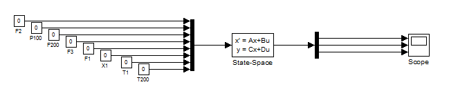{width="3.1496062992125986in"
height="0.766910542432196in"}

Fig. 9 diagrama de bloques en lazo abierto del sistema lineal
normalizado

# RESULTADOS

A.  *Controladores PID*

Trabajando sobre el modelo lineal normalizado, se obtienen las funciones
de transferencia que permitan entonar controladores PID adecuados para
cada variable. Estas funciones de transferencia son obtenidas a través
de la introducción de perturbaciones de forma de escalón unitario sobre
las variables manipuladas como se indica en la Tabla 4.

Las respuestas de las variables del proceso se muestran en la Fig. 10.
Se observa que la respuesta de la variable L2 es no autoregulado, y el
sistema es aproximadamente un integrador, en cambio las variables L2 y
X2 son autoreguladas BIBO estables. La respuesta de L2 es inversa y la
de X2 es directa. Las funciones de transferencia obtenidas, de primer
orden más tiempo muerto, se presentan en la Tabla 5.

Los controladores PID fueron entonados usando el procedimiento descrito
en \[8\]. Los tres controladores fueron implementados en simulink sobre
el proceso como se muestra en la Fig. 11.

Tabla 5. Parametros de controladores PID convencionales para el proceso

  ---------------------------------------------------------------------------------------------
  Función de transferencia                                         Kp              Ti
  ---------------------------------------------------------------- --------------- ------------
  $$\frac{L2(s)}{F2(s)} \approx - \frac{0.15}{s}$$                 -7.5            0

  $$\frac{P2(s)}{F200(s)} = - \frac{0.2112}{33s + 1}e^{- 3.3s}$$   42.61364        10.989

  $$\frac{X2(s)}{P100(s)} = \frac{1.822}{6s + 1}e^{- 0.8s}$$       3.70472         2.664
  ---------------------------------------------------------------------------------------------

B.  *Controladores difusos aproximados*

Conocidos los parámetros de entonamiento de los controladores PID, se
calculan los parámetros de ajuste de los controladores PID difusos
correspondientes y se convierten los controladores PID en controladores
difusos de Tipo Mamdani, tipo Takagi-Sugeno y de tipo Tsukamoto. Los
controladores de cada tipo son implementados en matlab. Se implementan
las reglas establecidas para el sistema de control sobre el modelo
lineal.

  ---------------------------------------------------------------------------------------
  {width="2.677165354330709in"   \(a\)
  height="2.010048118985127in"}                                 
  ------------------------------------------------------------- -------------------------
  {width="2.677165354330709in"   \(b\)
  height="2.010048118985127in"}                                 

  {width="2.677165354330709in"   \(c\)
  height="2.010048118985127in"}                                 
  ---------------------------------------------------------------------------------------

Fig. 10. Modelos de identificación por prueba escalón para (a) Nivel L2,
(b) Presión P2, (c) concentración X2

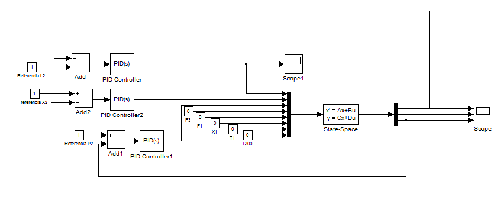{width="3.1496062992125986in"
height="1.3567038495188102in"}

Fig. 11. Diagrama de bloques en simulink del sistema lineal controlado
usando PID convencionales.

1)  *Controladores P difusos (FP)*

Para la implementación de un controlador P, la entrada definida es
solamente el error, la cual fue dividida en 5 subconjuntos difusos como
se muestra en la Fig. 12. Esta división es útil para el Modelo de
Inferencia de Mamdani (MIM), para el Modelo de Inferencia de
Takagi-Sugeno (MIS) y para el Modelo de Inferencia de Tsukamoto (MIT).
Las etiquetas utilizadas sobre el conjunto de error son: Muy negativo
(MN), negativo (N). Cero (C), positivo (P), muy positivo (MP). Todos son
subconjuntos triangulares.

Las funciones que representan a la variable de salida del controlador se
presentan en la Fig. 13. Las etiquetas lingüísticas utilizadas tienen el
mismo significado que las mostradas para la variable error, y para MIM
son funciones triangulares con corte en $\mu = 0.5$. El procedimiento de
\[1\] no describe la forma de las funciones para la utilización con MIT,
asi que la forma de las funciones de pertenencia y sus intervalos fueron
elegidos para intentar reproducir los resultados numéricos de la
experimentación con MIM. Los subconjuntos de la variable de salida para
MIT son funciones S.

{width="3.1496062992125986in"
height="2.3647626859142608in"}

Fig. 12. Subconjuntos difusos para la variable de entrada error

Las reglas establecidas para el diseño de los controladores FP dependen
del tipo de modelo de inferencia utilizado. Para MIM y MIS se presentan
en la Tabla 6 y para MIT se presentan en la Tabla 7. La aplicación de
estas reglas conduce a las curvas de respuesta del controlador FP
respecto al error mostradas en la Fig. 14

Tabla 6. Reglas del controlador FP usando MIM y MIT

  -----------------------------------------------------------------------
  Si error es                     Entonces salida es
  ------------------------------- ---------------------------------------
  Muy negativo                    Muy negativo

  Negativo                        Negativo

  Cero                            Cero

  Positivo                        Positivo

  muy positivo                    Muy positivo
  -----------------------------------------------------------------------

Tabla 7. Reglas del controlador P usando MIT.

  -----------------------------------------------------------------------
  Si error es                               Salida es
  ----------------------------------------- -----------------------------
  Muy negativo                              -2

  Negativo                                  -1

  Cero                                      0

  Positivo                                  1

  Muy postivo                               2
  -----------------------------------------------------------------------

  -----------------------------------------------------------------------
  {width="2.677165354330709in"     \(a\)
  height="2.0102220034995626in"}                                  
  --------------------------------------------------------------- -------
  {width="2.677165354330709in"     \(b\)
  height="2.0102220034995626in"}                                  

  -----------------------------------------------------------------------

Fig. 13. Subconjuntos difusos para la variable salida de controladores
FP (a) para MIM, (b) para MIS.

{width="3.1666666666666665in"
height="2.375in"}

Fig. 14.Curva de respuesta para el controlador FP

La curva de respuesta para MIM y MIS es muy similar, lo que conduce a
que el desempeño de los controladores FP sea muy parecido. El
controlador MIT tiene diferencias en su comportamiento en algunos puntos
respecto a los otros, sin embargo la cantidad de desviaciones indica que
el desempeño del controlador es semejante a los MIM y MIS. Es posible
que una selección cuidadosa de los subconjuntos difusos y una revisión
del código de implementación durante la búsqueda del valor de
pertenencia para MIT pueda acercar la curva de respuesta a la de los
otros métodos.

2)  *Controladores PI difusos incrementales (FPI)*

Para la descripción de los modelos de inferencia, se incluye ahora la
variable de cambio del error. Esta definición a través de sus
subconjuntos y etiquetas es igual a la definición hecha para la variable
error y se usa para los tres modelos de inferencia y se muestra en la
Fig. 15.

.

{width="3.1496062992125986in"
height="2.3647626859142608in"}

Fig. 15. Subconjuntos difusos para la variable de entrada cambio de
error

Para la descripción de la variable de salida del controlador, es
necesario definir el producto cartesiano entre los conjuntos de entrada,
es decir, la combinación de dos elementos de los conjuntos de entrada.
Esto conduce a la descripción de nueve subconjuntos para la variable de
salida, etiquetados como Negativo muy grande (NMG), Negativo grande
(NG), Negativo (N), Negativo Pequeño (NP), Cero (C), Positivo Pequeño
(PP), Positivo (P), Positivo Grande (PG), Positivo Muy Grande (PMG).
Para MIM, se muestra que los conjuntos son triangulares en la Fig. 16.
Para MIT se eligieron nuevamente funciones S con las mismas etiquetas
lingüísticas intentando replicar el resultado de MIM. La selección es la
que se observa en la Fig. 17.

Las reglas elegidas se componen como la combinación de todas las
entradas, como se muestra en la Tabla 8 para MIM y MIT y en la Tabla 9
para MIS.

{width="3.1496062992125986in"
height="2.3647626859142608in"}

Fig. 16. Subconjuntos difusos para la variable de salida incremental
para controlador Mamdani

{width="3.1666666666666665in"
height="2.3777777777777778in"}

Fig. 17. Subconjuntos difusos para la variable de salida incremental
para controlador Tsukamoto

Tabla 8. Reglas del controlador PI usando modelo de inferencia de
Mamdani y Tsukamoto

  ------------------------------------------------------------------------
  e\\Δe        MN             N          C         P         MP
  ------------ -------------- ---------- --------- --------- -------------
  MN           NMG            NG         N         NP        C

  N            NG             N          NP        C         PP

  C            N              NP         C         PP        P

  P            NP             C          PP        P         PG

  MP           C              PP         P         PG        PMG

                                                             
  ------------------------------------------------------------------------

Tabla 9. Reglas de controlador PI usando modelo de inferencia de
Takagi-Sugeno

  -----------------------------------------------------------------------
  e\\Δe          MN            N         C         P         MP
  -------------- ------------- --------- --------- --------- ------------
  MN             -4            -3        -2        -1        0

  N              -3            -2        -1        0         1

  C              -2            -1        0         1         2

  P              -1            0         1         2         3

  MP             0             1         2         3         4
  -----------------------------------------------------------------------

La utilización de estos conjuntos en la obtención de la superficie que
relaciona las entradas y salida de estos controladores FPI se muestra en
la Fig. 18. Superficie de respuesta para los controladores FPI. (a)
usando modelo de inferencia Mamdani. (b) usando modelo de inferencia
Takagi-Sugeno (c) Usando modelo de inferencia Tsukamoto.Fig. 18. La
respuesta cualitativa de los tres modelos de inferencia es similar, lo
que conduce a esperar que la respuesta de los controladores en lazo
cerrado también lo sea.

  -----------------------------------------------------------------------
  {width="2.677165354330709in"     \(a\)
  height="2.006403105861767in"}                                   
  --------------------------------------------------------------- -------
  {width="2.677165354330709in"     \(b\)
  height="2.006403105861767in"}                                   

  {width="2.677165354330709in"     \(c\)
  height="2.006403105861767in"}                                   
  -----------------------------------------------------------------------

Fig. 18. Superficie de respuesta para los controladores FPI. (a) usando
modelo de inferencia Mamdani. (b) usando modelo de inferencia
Takagi-Sugeno (c) Usando modelo de inferencia Tsukamoto.

C.  *Comparación entre los tres controladores difusos diseñados*

Para la implementación de los controladores difusos se requiere la
conversión de los parámetros de entonamiento de la Tabla 5 usando el
resumen mostrado en la Tabla 1. Debido a que el sistema está
normalizado, se supone que el rango del error es de \[-1,1\] lo que
permite escribir los nuevos parámetros de los controladores FP y FPI
como se presentan en la Tabla 10 y Tabla 11.

Tabla 10. Parámetros del controlador FP

  ------------------------------------------------------------------------
  Función de transferencia                           GE        GU
  -------------------------------------------------- --------- -----------
  $$\frac{L2(s)}{F2(s)} \approx - \frac{0.15}{s}$$   1         -7.5

  ------------------------------------------------------------------------

Tabla 11. Parámetros de los controladores FPI

  ------------------------------------------------------------------------------------------------
  Función de transferencia                                         GE      GCE         GCU
  ---------------------------------------------------------------- ------- ----------- -----------
  $$\frac{P2(s)}{F200(s)} = - \frac{0.2112}{33s + 1}e^{- 3.3s}$$   1       10.989      -3.877

  $$\frac{X2(s)}{P100(s)} = \frac{1.822}{6s + 1}e^{- 0.8s}$$       1       2.664       1.390
  ------------------------------------------------------------------------------------------------

La implementación de estos tres controladores diseñados MIM, MIS y MIT
se realizó en simulink a través de un diagrama de bloques como el que se
muestra en la Fig. 19. La respuesta del sistema multivariable ante
cambios en la referencia de las tres variables controladas se presenta
en la Fig. 20. Como es posible observar, el error de estado estacionario
para L2 usando MIT es más grande que para los otros dos controladores y
la respuesta de P2 es más lenta. De resto, aunque hay diferencias entre
los tres controladores, puede verse que el comportamiento de ellos es
aproximado como se esperaba en el análisis de la superficie de respuesta
de ellos. Desde el punto de vista de desempeño del algoritmo, la
implementación del algoritmo de MIS es más eficiente, requiriendo menos
tiempo de cálculo. El MIM estuvo en un lugar intermedio y MIT requirió
mas tiempo debido a la búsqueda de valores sobre una curva, que requiere
la implementación de un procedimiento de resolución de ecuaciones no
lineales.

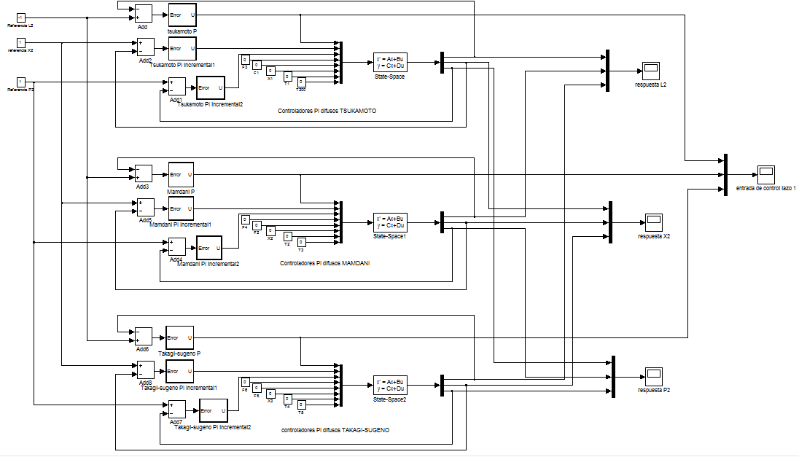{width="3.1666666666666665in"
height="1.8118055555555554in"}

Fig. 19 diagrama de bloques para la comparación de los controladores
difusos

  -----------------------------------------------------------------------
  {width="2.677165354330709in"     \(a\)
  height="2.0102220034995626in"}                                  
  --------------------------------------------------------------- -------
  {width="2.677165354330709in"     \(b\)
  height="2.0102220034995626in"}                                  

  {width="2.677165354330709in"     \(c\)
  height="2.0102220034995626in"}                                  

  {width="2.677165354330709in"     \(d\)
  height="2.0102220034995626in"}                                  
  -----------------------------------------------------------------------

Fig. 20. Respuesta comparativa de entrada de los controladores FPI
usando MIM, MIT y MIS para (a) Nivel L2, (b) Presión P2, (c)
Concentración X2, (d) Entrada de control F2 (actúa sobre L2)

D.  *Comparación entre los controladores difusos y los controladores PID
    clásicos*

Para la comparación de los controladores FPI y FP contra P y PI
clásicos, se eligió la utilización de MIM y MIS ya que MIT requiere
mayor tiempo de cálculo y es más exigente con los recursos
computacionales. El diagrama de bloques utilizado para la implementación
y comparación de estos controladores se muestra en la Fig. 21 y la
respuesta de las tres variables de estado en la Fig. 22.

Como puede observarse la conversión de los controladores a sus
aproximados difusos no es perfecta, es decir, no logra reproducir el
comportamiento de los controladores clásicos. Esto puede deberse a tres
factores:

-   Período de Muestreo de los controladores difusos diseñados. Los
    > controladores difusos diseñados realizan el cálculo de la entrada
    > cada minuto, mientras que el controlador clásico es una estructura
    > continua que afecta de manera continua a la variable de control.
    > Aunque esto no es posible apreciarlo en las respuestas graficas
    > debido a la cantidad de puntos utilizados, en la ecuación (5) se
    > observa que el período de muestreo afecta al comportamiento del
    > controlador excepto en el controlador P, donde la respuesta entre
    > el clásico y los difusos es esencialmente equivalente.

-   Validez de la equivalencia entre los controladores clásicos y
    > difusos. Como describe \[1\], la equivalencia entre los
    > controladores ocurre solamente en el sector de la superficie de
    > respuesta donde el comportamiento puede aproximarse por un plano,
    > esto es en el rango entre \[-2,2\] para el error y el cambio del
    > error. Cuando estas variables salen de este rango, la equivalencia
    > cesa, y los controladores presentan diferencia.

-   Algoritmo de implementación de los controladores difusos: para la
    > implementación en esta investigación se crearon versiones del
    > código de funcionamiento de los controladores difusos que no se
    > han analizado en cuanto a rendimiento ni a la introducción de
    > errores en el cálculo.

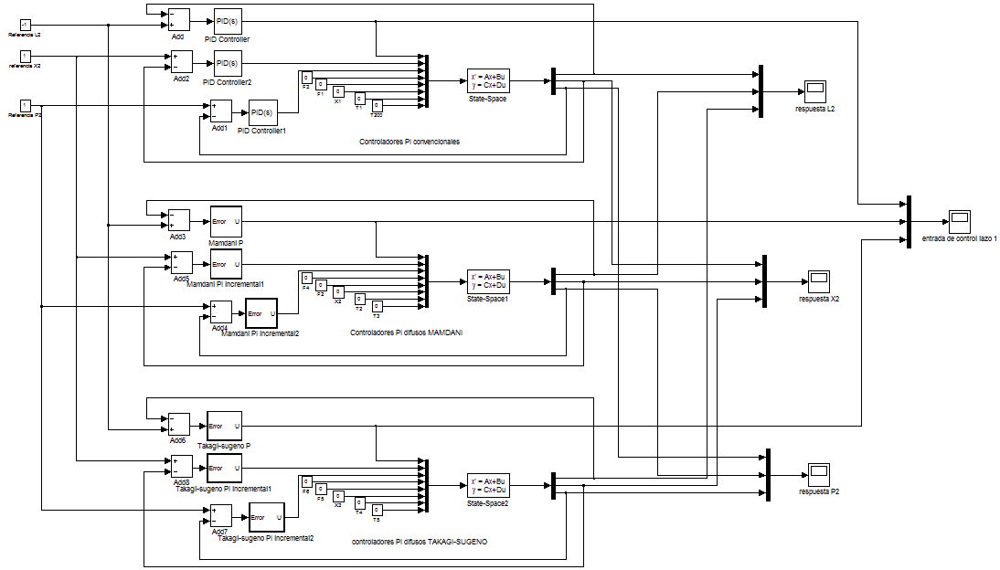{width="3.1496062992125986in"
height="1.7964654418197725in"}

Fig. 21 diagrama de bloques para la comparación entre controladores
difusos y clásicos

  -----------------------------------------------------------------------
  {width="2.677165354330709in"     \(a\)
  height="2.010048118985127in"}                                   
  --------------------------------------------------------------- -------
  {width="2.677165354330709in"     \(b\)
  height="2.010048118985127in"}                                   

  {width="2.677165354330709in"     \(c\)
  height="2.010048118985127in"}                                   

  {width="2.677165354330709in"     \(d\)
  height="2.010048118985127in"}                                   
  -----------------------------------------------------------------------

Fig. 22. Respuesta comparativa de entrada de los controladores PI, FPI
usando Mamdani y FPI usando Takagi-Sugeno para (a) Nivel L2, (b) Presión
P2, (c) Concentración X2, (d) Entrada de control F2 (actúa sobre L2)

E.  *Comparación con otro controlador difuso:*

En \[7\] se estableció un controlador difuso no lineal de la forma FPD+I
para la variable X2 manipulando P100, sin control en P2 y con un
controlador PID convencional para L2. El controlador difuso descrito
posee tres subconjuntos difusos para la entrada error y variación del
error con curvas gaussianas con etiquetas Negativo (N), Cero (C),
Positivo (P) como se observan en la Fig. 23.

  -----------------------------------------------------------------------
  {width="2.677165354330709in"     \(a\)
  height="2.010048118985127in"}                                   
  --------------------------------------------------------------- -------
  {width="2.677165354330709in"     \(b\)
  height="2.010048118985127in"}                                   

  -----------------------------------------------------------------------

Fig. 23. Subconjuntos difusos para el controlador \[7\]. (a) Subconjunto
para la variable error. (b) Subconjunto para la variable cambio de error

Los subconjuntos de salida están dados por funciones de campana
generalizadas etiquetadas como Muy negativo (MN), negativo (N), Cero
(C), positivo (P), muy positivo (MP) como se muestra en la Fig. 24.

El controlador implementado por \[7\], siguiendo la metodología descrita
por \[1\], es un controlador FPD+I, implementado sobre el modelo lo
lineal del proceso. El conjunto de reglas establecidas para este
controlador se muestran en la Tabla 12.

Tabla 12. Reglas para el controlador FPD+I \[7\]

  -----------------------------------------------------------------------
  e\\Δe                N                C              P
  -------------------- ---------------- -------------- ------------------
  N                    MN               N              C

  C                    N                C              P

  P                    C                P              MP
  -----------------------------------------------------------------------

{width="3.1496062992125986in"
height="2.3647626859142608in"}

Fig. 24.Subconjuntos difusos de la variable de salida del controlador
\[7\]

{width="3.1496062992125986in"
height="2.3647626859142608in"}

Fig. 25. Superficie del controlador presentado en \[7\]

Los parámetros reportados (sobre variables no normalizadas) para GE, GU,
GCE y GIE son

La superficie de respuesta del controlador FPD+I es el la que se muestra
en la Fig. 25. Los parámetros de entonamiento descritos en la Tabla 1
para este controlador se presentan en la Tabla 13.

Tabla 13. Parámetros del controlador FPD+I \[7\]

  -----------------------------------------------------------------------
  Parámetro                               Valor
  --------------------------------------- -------------------------------
  GE                                      20

  GU                                      10

  GCE                                     10

  GIE                                     3
  -----------------------------------------------------------------------

Usando los controladores P y PI correspondientes a las variables L2 y X2
del sistema se comparan las respuestas del controlador obtenido por
\[7\] contra los MIM y MIS desarrollados en esta investigación usando el
diagrama de bloques de Fig. 26 y con resultados mostrados en la Fig. 27.

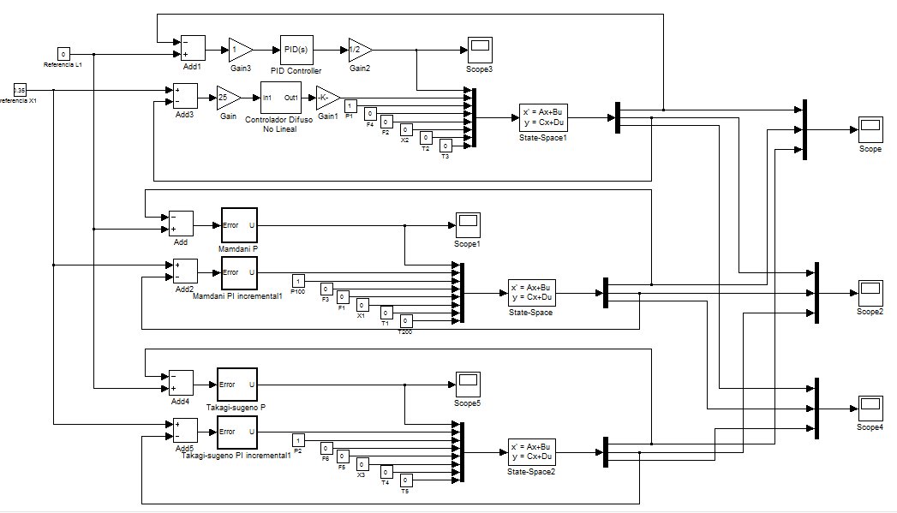{width="3.188976377952756in"
height="1.8243339895013124in"}

Fig. 26. Diagrama de bloques para comparación con \[7\]

  -----------------------------------------------------------------------
  {width="2.677165354330709in"     \(a\)
  height="2.010048118985127in"}                                   
  --------------------------------------------------------------- -------
  {width="2.677165354330709in"     \(b\)
  height="2.010048118985127in"}                                   

  {width="2.677165354330709in"     \(c\)
  height="2.010048118985127in"}                                   
  -----------------------------------------------------------------------

Fig. 27. Respuesta comparativa de entrada de los controladores FPD+I,
FPI usando Mamdani y FPI usando Takagi-Sugeno para (a) Nivel L2, (b)
Presión P2, (c) Concentración X2

Para cambios en la referencia de X2, se observa que el controlador de L2
usando MIM y MIS es más rápido y con menos oscilaciones que el
presentado por \[7\] pero con error de estado estacionario. La respuesta
de X2, en cambio, es mas lenta que el FPD+I. La P2 cambia sin control
hasta su nuevo valor de estado estacionario, que en el FPD+I cambia con
menos oscilaciones. En general, debido a la presencia de error de estado
estacionario y a la diferencia de velocidad del control de X2, se podría
decir que el controlador FPD+I es mejor para el sistema. Para
desarrollar un análisis más exhaustivo es necesario modificar el
controlador FPD+I para trabajar con otro período de muestreo similar al
utilizado en esta investigación, lo que está más allá del alcance de la
misma.

# CONCLUSIONES

El procedimiento descrito por \[1\] para la conversión de controladores
difusos aproximados a controladores PID convencionales fue implementado
sobre el modelo lineal multivariable de un proceso de evaporación. Esta
metodología descrita permite, conocidos los parámetros de entonamiento
de los controladores PID, describir inmediatamente controladores difusos
a través de la conversión de sus parámetros de entonamiento.

La conversión de controladores es posible usando sistemas de inferencias
difusos de Mamdani, de Takagi-Sugeno y de Tsukamoto, que producen
resultados similares sobre la señal de control y sobre los procesos
cuando se implementan controladores proporcionales puros. Para el caso
de controladores PI, la conversión y superposición depende de la
utilización del mismo período de muestreo y solo es válida en una región
del espacio bidimensional descrito por la variable error y la variable
cambio del error.

El sistema de inferencia de Takagi-Sugeno tiene una implementación
computacional mucho más simple y que requiere menor número de cálculos
que el de Mamdani y el de Tsukamoto. En general, el sistema de
inferencia de Tsukamoto requiere vincular el algoritmo a
especificaciones de la forma de las funciones de pertenencia del
subconjunto de salida a fin de mejorar el procedimiento de búsqueda de
la solución de cada regla asociada. Debido a esto, el controlador FPI de
Tsukamoto presenta diferencias apreciables respecto al de Mamdani y
Takagi-Sugeno, que resultaron ser muy similares como sistemas de
control.

# REFERENCIAS

  ----------------------------------------------------------------------------
  \[1\]   J. Jantzen, «Tunning of Fuzzy PID controllers,» Universidad Técnica
          de Dinamarca, Copenhague, 1999.
  ------- --------------------------------------------------------------------
  \[2\]   J. E. Rodríguez y J. P. Requez, «Conrol Difuso de las temperaturas
          de fondo y de tope en una torre de destilación binaria Etanol-Agua,»
          UNEXPO, Barquisimeto, 2012.

  \[3\]   I. Iancu, «A Mamdani Type Fuzzy Logic Controller,» de *Fuzzy Logic -
          Controls, Concepts, Theories and Applications*, E. Dadios, Ed.,
          2002.

  \[4\]   J.-S. R. Jang, C.-T. Sun y E. Mizutani, Neuro-Fuzzy and Soft
          Computing, Prentice-Hall, 1997.

  \[5\]   L. Reznik, Fuzzy Controllers, Melbourne: Elsevier, 1997.

  \[6\]   R. B. Newell y P. L. Lee, Applied Process Control, Melbourne:
          Prentice Hall, 1989.

  \[7\]   E. Barreto y J. P. Requez, «Sistema de control PID-difuso de la
          concentración de soluto a la salida de un evaporador de circulación
          forzada de tubos verticales,» UNEXPO, Venezuela, Barquisimeto, 2012.

  \[8\]   A. O\'Dwyer, Handbook of PI and PID controller tuning rules.,
          Dublín: Instituto de Tecnología de Dublín, 2009.
  ----------------------------------------------------------------------------
